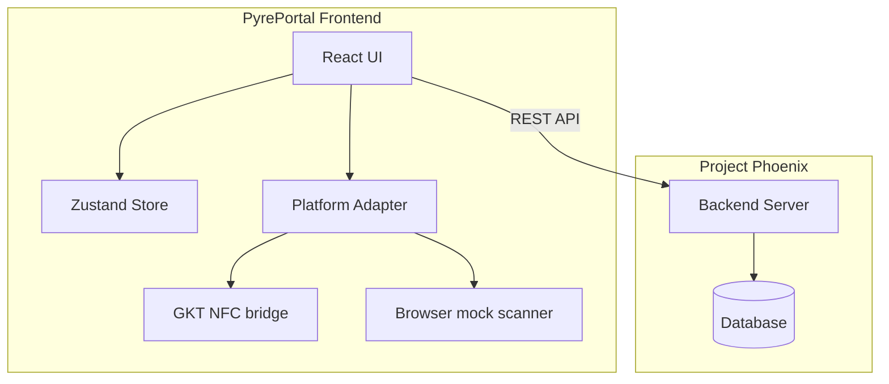
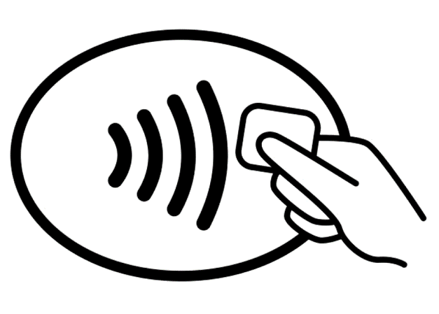

# PyrePortal


[](https://react.dev)
[](https://www.typescriptlang.org)
[](package.json)

PyrePortal is the web kiosk frontend for German after-school care (OGS). Staff use NFC/RFID wristbands to check students in and out, pick rooms, run activities, and track attendance from a kiosk device.

## Supported Targets

- **GKT/GKTL kiosk devices**: production target. NFC is provided by the GKT system bridge via `system.js`.
- **Browser/Mac mock**: local development target. Mock RFID scans are generated in the frontend.

The old Raspberry Pi/Tauri/Balena target is retired. Its source code may still exist during the staged cleanup, but it is no longer built, tested, released, or deployed.

## What It Does

- **RFID check-in/check-out**: scan a wristband and the server records the student's arrival or departure.
- **PIN authentication**: staff unlock the kiosk with a shared OGS PIN or individual teacher PIN.
- **Room and activity management**: choose a room, start an activity session, assign supervisors, and see live occupancy.
- **Attendance tracking**: view student status, toggle check-in/check-out, and submit daily feedback.
- **RFID tag assignment**: pair wristbands to students or staff directly from the kiosk UI.
- **Network-aware UI**: shows connection quality and German-language error messages.

## Architecture


```mermaid
flowchart TB
    subgraph "PyrePortal Frontend"
        UI[React UI] --> Store[Zustand Store]
        UI --> Platform[Platform Adapter]
        Platform --> GKT[GKT NFC bridge]
        Platform --> Mock[Browser mock scanner]
    end

    subgraph "Project Phoenix"
        Server[Backend Server] --> DB[(Database)]
    end

    UI -->|REST API| Server
```

| Layer              | Role                                               |
| ------------------ | -------------------------------------------------- |
| React + TypeScript | UI, routing, state, RFID scanning flow             |
| Platform adapters  | GKT NFC bridge and browser mock implementations    |
| Project Phoenix    | Source of truth for students, staff, rooms, visits |

### Key Design Decisions

1. **Server-first RFID scans.** Every scan hits the backend before the UI reacts. No local student cache.
2. **Platform adapters.** `BUILD_TARGET=gkt` bundles the GKT adapter; plain browser builds use the mock adapter.
3. **Two-level auth on every request.** Device API key (`Authorization: Bearer ...`) plus staff PIN (`X-Staff-PIN` header).
4. **Backend-owned data.** Project Phoenix is the source of truth for rooms, sessions, attendance, and tag assignments.

## Tech Stack

| Component  | Technology   | Version |
| ---------- | ------------ | ------- |
| Frontend   | React        | 19      |
| Language   | TypeScript   | 5.9     |
| State      | Zustand      | 5       |
| Routing    | React Router | 7       |
| Styling    | TailwindCSS  | 4       |
| Build Tool | Vite         | 8       |

## Getting Started

### Prerequisites

- [Node.js](https://nodejs.org/) v18+
- pnpm 10+

### Setup

```bash
git clone git@github.com:moto-nrw/PyrePortal.git
cd PyrePortal
pnpm install
```

Create a `.env` file in the project root for local browser development:

```bash
VITE_API_BASE_URL=http://localhost:8080
VITE_DEVICE_API_KEY=your_dev_device_key
VITE_MOCK_RFID_TAGS=04:D6:94:82:97:6A:80
```

GKT deployments pass the device API key through the kiosk URL (`?key=...`) and bake the API base URL into the GKT build.

### Run

```bash
pnpm run dev
```

### Build

```bash
pnpm run build:gkt    # Production GKT bundle
pnpm run build        # Browser/mock bundle
```

### Code Quality

```bash
pnpm run check        # ESLint + TypeScript
pnpm run test         # Vitest
pnpm run format       # Prettier auto-format
```

## API Endpoints

PyrePortal talks to the Project Phoenix backend over REST. All requests carry device and staff credentials.

| Endpoint                           | Method | Purpose                   |
| ---------------------------------- | ------ | ------------------------- |
| `/api/iot/teachers`                | GET    | Fetch staff list          |
| `/api/iot/ping`                    | POST   | Validate global PIN       |
| `/api/iot/status`                  | GET    | Validate teacher PIN      |
| `/api/iot/activities`              | GET    | Today's activities        |
| `/api/iot/rooms/available`         | GET    | Available rooms           |
| `/api/iot/checkin`                 | POST   | RFID check-in/check-out   |
| `/api/iot/session/start`           | POST   | Start activity session    |
| `/api/iot/session/end`             | POST   | End session               |
| `/api/iot/session/current`         | GET    | Current session info      |
| `/api/iot/session/activity`        | POST   | Prevent session timeout   |
| `/api/iot/students`                | GET    | Students by teacher       |
| `/api/iot/rfid/:tagId`             | GET    | Check tag assignment      |
| `/api/students/:id/rfid`           | POST   | Assign tag to student     |
| `/api/iot/staff/:id/rfid`          | POST   | Assign tag to staff       |
| `/api/iot/attendance/status/:rfid` | GET    | Student attendance status |
| `/api/iot/attendance/toggle`       | POST   | Toggle check-in/check-out |
| `/api/iot/feedback`                | POST   | Submit daily feedback     |
| `/health`                          | GET    | Server health check       |

## Usage

<details>
<summary>Staff Authentication</summary>

Enter your PIN on the login screen. PyrePortal validates it against the backend and grants access.



</details>

<details>
<summary>Room Selection</summary>

Pick a room after logging in. Each room shows its current status:

-  Occupied
-  Available

Room types include:

-  School Yard
-  Toilet

</details>

<details>
<summary>Activities and Feedback</summary>

Start an activity, assign supervisors, and scan students in. At checkout, staff can leave daily feedback:

-  Positive
-  Neutral
-  Negative

</details>

## Troubleshooting

<details>
<summary>Common Issues</summary>

### App won't start

- Check local `.env` for `VITE_API_BASE_URL` and `VITE_DEVICE_API_KEY`.
- For GKT, confirm the kiosk URL contains `?key=...`.
- Confirm the backend is reachable: `curl http://localhost:8080/health`.

### Build errors

```bash
rm -rf node_modules dist
pnpm install
pnpm run build:gkt
```

### RFID/NFC not working

- Browser development uses mock scans from `VITE_MOCK_RFID_TAGS`.
- GKT devices receive NFC scans through the `SYSTEM.registerNfc` bridge.
- Check browser console logs for scanner initialization and scan events.

### API connection fails

- Confirm Project Phoenix is running.
- Check the device API key matches what the server expects.

</details>

## Roadmap

- [ ] Attendance analytics dashboard
- [ ] Session timeout UI warnings
- [ ] Offline mode with retry queue
- [ ] Multi-language support
- [ ] Biometric authentication
- [ ] Mobile companion app

## License

Source-Available License -- see [LICENSE](LICENSE) for details.

Copyright (c) 2024-2026 MOTO. For licensing inquiries: kontakt@moto.nrw
