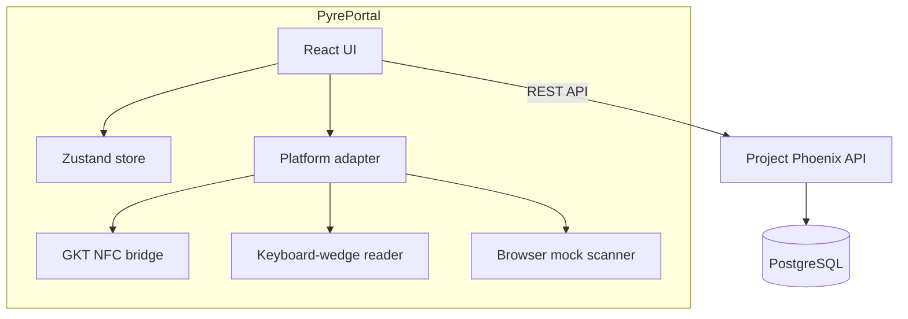

# PyrePortal


[](https://react.dev)
[](https://www.typescriptlang.org)
[](package.json)

PyrePortal is moto's browser-based kiosk for German after-school care (OGS). Staff use NFC/RFID wristbands to manage attendance, rooms, activities and staff working time.

## Runtime Targets

| Target       | Status                        | RFID source                           |
| ------------ | ----------------------------- | ------------------------------------- |
| **GKT/GKTL** | Production                    | GKT `system.js` bridge                |
| **Wedge**    | Tablet build; hosting pending | USB reader in keyboard-emulation mode |
| **Browser**  | Local development             | Frontend-generated mock scans         |

The Raspberry Pi/Balena and Tauri targets are retired. They are not supported development or release targets, and the Tauri source has been removed. New work must target GKT, Wedge or the browser mock.

## Features

- PIN-based staff authentication
- Student check-in, check-out and room changes by RFID
- Activity sessions, room selection and supervisor teams
- RFID tag assignment for students and staff
- Staff time tracking by RFID
- Pickup-time lookup
- Network status monitoring and German user-facing errors

## Architecture


```mermaid
flowchart TB
    subgraph "PyrePortal"
        UI[React UI] --> Store[Zustand store]
        UI --> Adapter[Platform adapter]
        Adapter --> GKT[GKT NFC bridge]
        Adapter --> Wedge[Keyboard-wedge reader]
        Adapter --> Browser[Browser mock scanner]
    end

    UI -->|REST API| API[Project Phoenix API]
    API --> DB[(PostgreSQL)]
```

The frontend follows three rules:

1. **The server is authoritative.** RFID actions complete on the Project Phoenix backend before the UI shows a result.
2. **Platform code stays behind adapters.** `BUILD_TARGET` selects the GKT, Wedge or browser implementation at build time.
3. **Duplicate scans are rejected at multiple layers.** The store tracks in-flight tags, and the scanning hook rejects duplicate adapter events.

Project Phoenix is the source of truth for students, staff, rooms, sessions, attendance and RFID assignments.

## Tech Stack

| Part     | Technology                                  |
| -------- | ------------------------------------------- |
| UI       | React 19, React Router 7                    |
| Language | TypeScript 6                                |
| State    | Zustand 5                                   |
| Styling  | Tailwind CSS 4, moto design system          |
| Build    | Vite 8                                      |
| Tests    | Vitest 4, React Testing Library, Playwright |

## Development

### Requirements

- Node.js 22.12 or newer
- pnpm 10
- A local [Project Phoenix](https://github.com/moto-nrw/project-phoenix) backend for end-to-end flows

### Setup

```bash
git clone git@github.com:moto-nrw/PyrePortal.git
cd PyrePortal
pnpm install
cp .env.example .env
pnpm run dev
```

The browser build reads these local settings:

```bash
VITE_API_BASE_URL=http://localhost:8080
VITE_DEVICE_API_KEY=your_dev_device_key
VITE_MOCK_RFID_TAGS=04:D6:94:82:97:6A:80
```

Mock tags must exist in the connected Project Phoenix database.

### Commands

| Command                | Purpose                                |
| ---------------------- | -------------------------------------- |
| `pnpm run dev`         | Start browser/mock development         |
| `pnpm run dev:wedge`   | Start local Wedge development          |
| `pnpm run build:gkt`   | Build the production GKT bundle        |
| `pnpm run build:wedge` | Build the Wedge bundle                 |
| `pnpm run build`       | Build the browser/mock bundle          |
| `pnpm run check`       | Run ESLint and TypeScript checks       |
| `pnpm run test`        | Run Vitest                             |
| `pnpm run screenshots` | Capture the Playwright screenshot flow |
| `pnpm run format`      | Format supported files with Prettier   |

### Test the GKT Adapter Locally

Run the real GKT frontend path against a local backend:

```bash
BUILD_TARGET=gkt VITE_API_BASE_URL=http://localhost:8080 pnpm run dev
```

Open `http://localhost:1420/?key=<device-api-key>`, then simulate a scan in the browser console:

```js
SYSTEM.onNfcScanned({ uid: '04:D6:94:82:97:6A:80', eventSource: 'NFC', eventNumber: 1 });
```

This exercises `system.js`, the GKT adapter and the server round-trip without a kiosk device.

## Backend Integration

PyrePortal calls the Project Phoenix `/api/iot/*` API. Device requests use a bearer API key; staff actions also send the active PIN and staff ID when available:

```http
Authorization: Bearer <device-api-key>
X-Staff-PIN: <pin>
X-Staff-ID: <staff-id>
```

The API client and response types live in [`src/services/api.ts`](src/services/api.ts). Backend error strings are mapped to German UI messages in [`src/services/apiErrors.ts`](src/services/apiErrors.ts); changing backend text can change which message users see.

## Documentation

- [Wedge reader setup](docs/wedge-reader-setup.md): hardware, reader configuration, local testing and rollout
- [Screenshot and video tooling](screenshots/README.md): deterministic Playwright capture flow
- [Contributor guidance](CLAUDE.md): repository architecture and implementation rules

## License

Source-Available License -- see [LICENSE](LICENSE) for details.

Copyright (c) 2024-2026 MOTO. For licensing inquiries: kontakt@moto.nrw
