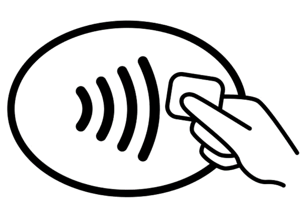

# PyrePortal


[](https://tauri.app)
[](https://react.dev)
[](https://www.typescriptlang.org)
[](package.json)

A Raspberry Pi kiosk app for German after-school care (OGS). Staff tap RFID wristbands to check students in and out, pick rooms, run activities, and track attendance — all from a single touchscreen.

## What It Does

- **RFID check-in/check-out** — Scan a wristband, and the server records the student's arrival or departure instantly.
- **PIN authentication** — Staff unlock the kiosk with a PIN. Supports both a shared OGS PIN and individual teacher PINs.
- **Room and activity management** — Choose a room, start an activity session, assign supervisors, and see live occupancy.
- **Attendance tracking** — View student status, toggle check-in/check-out, and submit daily feedback (positive / neutral / negative).
- **RFID tag assignment** — Pair wristbands to students or staff directly from the device.
- **Network-aware** — Shows connection quality and gives clear German-language error messages when things go wrong.
- **Structured logging** — Logs flow from the browser to Rust to disk, with automatic file rotation.

## Target Hardware

**Raspberry Pi 5** (64-bit, `aarch64-unknown-linux-gnu`), fullscreen kiosk mode, MFRC522 RFID reader on SPI.

The app builds on macOS, Windows, and Linux for development, but the RFID reader only works on ARM/ARM64 Linux with the `rfid` feature flag. On other platforms, a mock scanner fills in for testing.

## Architecture


| Layer              | Role                                               |
| ------------------ | -------------------------------------------------- |
| React + TypeScript | UI, routing, state (Zustand), RFID scanning hook   |
| Rust (Tauri v2)    | Runtime config, file logging, SPI/RFID hardware    |
| Project Phoenix    | Source of truth for students, staff, rooms, visits |

### Key Design Decisions

1. **Server-first RFID scans.** Every scan hits the backend before the UI reacts. No local student cache.
2. **Multi-layer duplicate prevention.** Hardware emits repeated events per tap; three filters (processing queue, 2-second cooldown, student history) stop duplicates.
3. **Runtime config via Rust.** API keys live in `.env` and are read by Rust at startup — never baked into the frontend build.
4. **Two-level auth on every request.** Device API key (`Authorization: Bearer ...`) plus staff PIN (`X-Staff-PIN` header).

## Tech Stack

| Component  | Technology   | Version  |
| ---------- | ------------ | -------- |
| Framework  | Tauri        | v2       |
| Frontend   | React        | 19       |
| Language   | TypeScript   | 5.9      |
| State      | Zustand      | 5        |
| Routing    | React Router | 7        |
| Styling    | TailwindCSS  | 4        |
| Build Tool | Vite         | 7        |
| Backend    | Rust         | 2021 ed. |

## Getting Started

### Prerequisites

- [Node.js](https://nodejs.org/) v18+
- [Rust](https://www.rust-lang.org/tools/install) (stable)
- Platform deps for [Tauri v2](https://v2.tauri.app/start/prerequisites/)

### Setup

```bash
git clone git@github.com:moto-nrw/PyrePortal.git
cd PyrePortal
npm install
```

Create a `.env` file in the project root:

```bash
API_BASE_URL=http://localhost:8080
DEVICE_API_KEY=your_device_key
VITE_ENABLE_RFID=false          # true on Pi with hardware
VITE_MOCK_RFID_TAGS=04:D6:94:82:97:6A:80
```

### Run

```bash
npm run tauri dev    # Full app (Rust + React)
npm run dev          # Frontend only (faster, no RFID)
```

### Build

```bash
npm run tauri build
# Output: src-tauri/target/release/bundle/
```

### Code Quality

```bash
npm run check        # ESLint + TypeScript (must pass before committing)
npm run format       # Prettier auto-format
cd src-tauri && cargo clippy   # Rust linter
```

## API Endpoints

PyrePortal talks to the Project Phoenix backend over REST. All requests carry device and staff credentials.

| Endpoint                           | Method | Purpose                   |
| ---------------------------------- | ------ | ------------------------- |
| `/api/iot/teachers`                | GET    | Fetch staff list          |
| `/api/iot/ping`                    | POST   | Validate global PIN       |
| `/api/iot/status`                  | GET    | Validate teacher PIN      |
| `/api/iot/activities`              | GET    | Today's activities        |
| `/api/iot/rooms/available`         | GET    | Available rooms           |
| `/api/iot/checkin`                 | POST   | RFID check-in/check-out   |
| `/api/iot/session/start`           | POST   | Start activity session    |
| `/api/iot/session/end`             | POST   | End session               |
| `/api/iot/session/current`         | GET    | Current session info      |
| `/api/iot/session/activity`        | POST   | Prevent session timeout   |
| `/api/iot/students`                | GET    | Students by teacher       |
| `/api/iot/rfid/:tagId`             | GET    | Check tag assignment      |
| `/api/students/:id/rfid`           | POST   | Assign tag to student     |
| `/api/iot/staff/:id/rfid`          | POST   | Assign tag to staff       |
| `/api/iot/attendance/status/:rfid` | GET    | Student attendance status |
| `/api/iot/attendance/toggle`       | POST   | Toggle check-in/check-out |
| `/api/iot/feedback`                | POST   | Submit daily feedback     |
| `/health`                          | GET    | Server health check       |

## Usage

<details>
<summary>Staff Authentication</summary>

Enter your PIN on the login screen. PyrePortal validates it against the backend and grants access.



</details>

<details>
<summary>Room Selection</summary>

Pick a room after logging in. Each room shows its current status:

-  Occupied
-  Available

Room types include:

-  School Yard
-  Toilet

</details>

<details>
<summary>Activities and Feedback</summary>

Start an activity, assign supervisors, and scan students in. At checkout, staff can leave daily feedback:

-  Positive
-  Neutral
-  Negative

</details>

## Troubleshooting

<details>
<summary>Common Issues</summary>

### App won't start

- Check `.env` for `API_BASE_URL` and `DEVICE_API_KEY`
- Check logs: `~/Library/Logs/pyreportal/` (macOS) or `~/.config/pyreportal/logs/` (Linux)
- Verify Tauri platform deps are installed

### Build errors

```bash
npm run clean:target   # Clean Rust artifacts
rm -rf node_modules dist
npm install
npm run tauri build
```

### RFID not working

- Development: set `VITE_ENABLE_RFID=false` in `.env`
- Pi hardware: run `cd src-tauri && ./test_rfid.sh`
- Console should show "RFID service initialized"

### API connection fails

- Confirm backend is running: `curl http://localhost:8080/health`
- Check `DEVICE_API_KEY` matches what the server expects

</details>

## Roadmap

- [ ] Attendance analytics dashboard
- [ ] Session timeout UI warnings
- [ ] Offline mode with retry queue
- [ ] Multi-language support
- [ ] Biometric authentication
- [ ] Mobile companion app

## License

Source-Available License -- see [LICENSE](LICENSE) for details.

Copyright (c) 2024-2026 MOTO. For licensing inquiries: kontakt@moto.nrw
